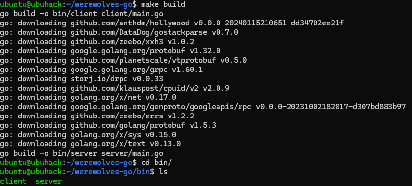

## WEREWOLVES GAME 

This repo creates the well known werewolves game using Go Programming language. The program is architectured around using Actor model for defining the server and client programs. The communication mode is using gRPC which supports bidirectional streaming for RPCs.

## STACK

- [Go](https://go.dev/)
- [Hollywood](https://github.com/anthdm/hollywood)
- [dRPC](https://github.com/storj/drpc)

## Installation requirements (Windows)
- Download [Windows](https://go.dev/dl/) installation section from the releases history.

## Installation requirements (Linux)

- Downloading Golang
  1. Wget go files ```wget https://go.dev/dl/go1.22.2.linux-amd64.tar.gz```
  2. Run ```sudo rm -rf /usr/local/go```to remove any existing installations
  3. Run ```sudo tar -C /usr/local -xzf go1.22.2.linux-amd64.tar.gz``` to extract contents to local user path in Linux.
  4. Run ```export PATH=$PATH:/usr/local/go/bin```
  5. Run ```go version``` (If the go version gets listed, your installation worked fine)

## Repo setup instructions
- Get Werewolves repo
  - Run ``` git clone https://github.com/codlocker/werewolves-go.git```
  - Or you can use Download ZIP or Download tar file in case git isn't installed in the system

## How to run?
1. Ensure you are in the werewolf code repo (Run ```cd werewolves-go/```)
2. Run ```make build```
  - 
3. The client and server builds are created in the [/bin/](./bin/) folder.
4. Clean existing builds by running ```make clean``` (if required).

5. #### Run Server first (Everything needs to run in werewolves-go path)
  - To run server execute command
    - Execute: ```cd bin/```
    - Execute: ```./server```
6. #### Run Clients next (Everything needs to run in werewolves-go path)
  - To run client execute command (Open a new terminal window for each client you want to run)
    - Execute: ```cd bin/```
    - Execute (**change username** to a new name in every client window): ```./client -username=<username>```
      - Examples: ```./client username=a```
      - Examples: ```./client username=b```
      - Examples: ```./client username=c```
      - Examples: ```./client username=d```

POSSIBLE ERRORS

- Go package missing or go.mod errors

  - Run ``` go mod tidy ```

- In case the above steps fail, you can directly run the code as follows

  - Server code:
    - ``` cd server/```
    - ``` go run main.go```

  - Client code:
    - ``` cd client/```
    - ``` go run main.go```
